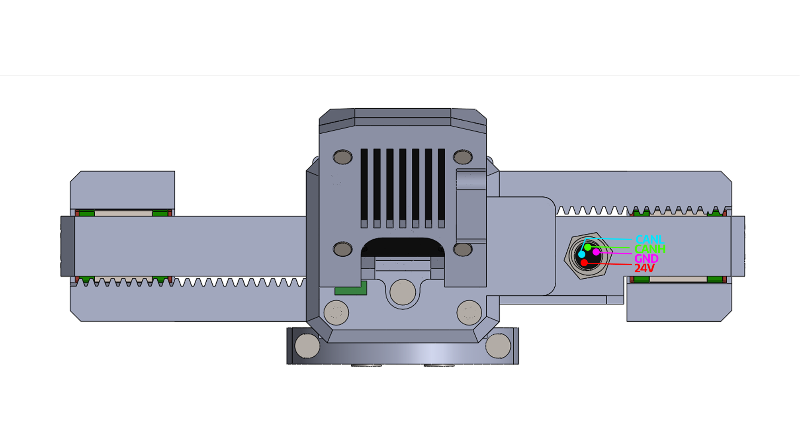

# **About the gripper**

    
  

MSG compliant AI stepper gripper is a gripper based on StepFOC stepper drivers. It is a gripper capable of controlling its gripping force (We use FOC control on steppers :D), making it perfect for assembly tasks and human-robot collaboration AND AI training application because of its designed with cameras in mind! This gripper is modular in nature in 2 ways:

* Adjust grip length with different linear rails with options of 100mm,150mm and 200mm.
* Adjust grip strength with different stepper sizes, supporting steppers of lenght 21.5mm, 40mm and 60mm

Grip force can be adjusted allowing you to grasp a wide range of items; from delicate and soft to rigid and sturdy.

Mechanical files and firmware are open source allowing you to add a custom griping tool and attach it to any robotic arm or robot. Gripper software is also open-source.

## **Building your own**

If you plan to build MSG gripper by yourself you will need to:

Print files from STEP files folder

Example: For 100 mm rail style gripper

- print everything from "common parts" folder
- everything from "Linear rail dependant parts" folder -> "100mm rail" folder
- everything from "Stepper dependant parts" folder depending on what stepper size you are using

-------------------------------------------------------------------------------------------------------

* Source all the parts from the [BOM](https://github.com/PCrnjak/MSG-compliant-AI-stepper-gripper/blob/main/BOM.md)
* Follow [Assembly instructions *coming soon](https://github.com/PCrnjak/SSG-48-adaptive-electric-gripper/tree/main/Assembly%20manual) or [Video instructions](https://www.youtube.com/watch?v=127zXHKuqIg) to assemble your gripper
* Follow [DOCS](https://source-robotics.github.io/MSG-gripper-docs/) to get your gripper up and running.

## **General specs:**

* Power supply: 24V
* Idle power: 0.5W
* Weight: 400 g
* Maximum gripping force: TBD
* Minimum gripping force: TBD
* Operating temperature -5 to 65 deg
* Communication interface: CAN bus
* CAN baud rate: 1Mbit
* Material: PETG plastic
* Stroke: 3 options: 55mm, 105mm and 155mm

## **Gripper stroke**

    
 

On the image is MSG gripper with 105mm stroke using 150mm rail. Other options are:

* with 100mm rail stroke is 55mm
* with 200mm rail stroke is 155mm

## **Grasps**

Gripper can perform 2 types of graps:

* External grasp – Used to hold objects by applying pressure from the outside.
* Internal grasp - Allows you to grasp hollow objects by applying pressure from the inside.

## **Pinout and connection**

    
 

The gripper is powered and controlled with single cable that carries CAN bus communication and 24V power supply.

!!! Tip annotate "Voltages" 
    To power the gripper you need to use 24V.  
    You can send commands to the gripper using **5V** CAN bus. 

## **3D model**

[Link to the STEP model](https://github.com/PCrnjak/SSG-48-adaptive-electric-gripper/tree/main/STEPS)

    
 

## **Torque curves**

Coming soon!

As you can see from the plot relationship between current and applied force is linear.  Unit of current is Ampere [A] and unit of Force is Newton [N].

!!! Note annotate "Torque curve" 
    Note that this plot only applies to the grippers bought from source robotics that use BLDC motors with fine tuned Kt of 0.325. If you are building your own gripper this value might be different.

## **CAN bus termination**

    
 

This can be adjusted by flipping the switch to "ON" to enable 120 ohm resistor termination for CAN bus and flipping it to "1" to disable it!

## **STEPFOC driver config**

!!! Note annotate "Config" 
    If you bought the gripper it comes preconfigured and calibrated!

If you are building the gripper you will need to send the following commands to it over serial to place the BLDC controller in the gripper mode and enable the thermistor:  

    #Gripper 1
    #Term 1
    #Kiiq 0.3
    #Kpiq 3
    #Save
    #Clear
    #Gripcal

## **Gripper linear speed calculation**

Gripper min and max speed is commanded and returned in 0-255 format.   
 
In the STEPFOC firmware these values are maped to ticks/s 255 = 60000 ticks/s while 0 = 500 ticks/s   
 
To calculate linear speed of the gripper jaws use this formula:   
 

r = 0.0083 m, C is the commanded speed from 0–255

$$
\text{ticks_per_s} = 500 + \left(\frac{60000 - 500}{255}\right) \times C
$$

$$
\omega = \frac{\text{ticks_per_s}}{2^{14}} \times 2\pi
$$

$$
v = \omega \times r
$$

## **Gripper Force Calculation**

You can find out your Kt value for your specific motor from UART command #Kt 

!!! Note annotate "Iq units" 
    Note that units of Iq are in mA. Before calculations transform it to A!

$$
T = K_t \times I_q
$$

$$
F = \frac{T}{r}
$$